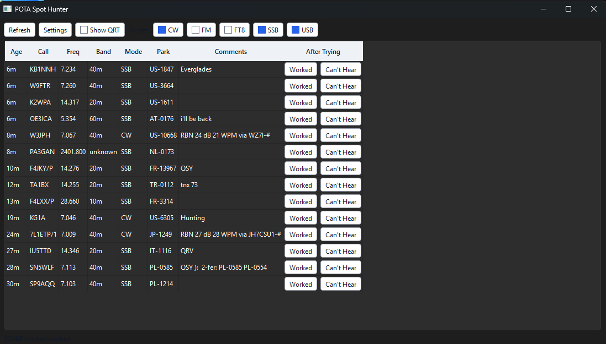

# POTA Spot Hunter

POTA Spot Hunter is a Python desktop app for quickly working Parks on the Air activator spots.



The first version targets Windows station use with OmniRig and WSJT-X-compatible UDP logger updates. The app can still be developed and tested on macOS with a fake rig controller.

## Development

```bash
python -m venv .venv
source .venv/bin/activate
pip install -e ".[dev]"
pytest
python -m pota_spot_hunter
```

On Windows, install the Windows extra:

```powershell
py -m venv .venv
.\.venv\Scripts\Activate.ps1
pip install -e ".[dev,windows]"
pota-spot-hunter
```

## Integrations

- POTA spots are fetched from `https://api.pota.app/spot/activator`.
- OmniRig control is used on Windows through COM.
- Logger updates are sent as WSJT-X-compatible UDP messages. Log4OM is the first validation target.
- Completed QSOs are sent to the logger as WSJT-X-compatible Logged ADIF messages with contact details and POTA park reference. Station identity remains managed by the logger.

## Spot Filters

- QRT spots are hidden by default. Enable `Show QRT` to include them.
- Mode filters are shown as independent checkboxes, so multiple modes can be visible at the same time.
- The leftmost `Age` column shows compact spot freshness from the POTA `spotTime` value, such as `2m` or `1h 12m`; spots are sorted newest first.

## Keyboard Controls

- `j` or `Down Arrow`: move the highlighted spot down.
- `k` or `Up Arrow`: move the highlighted spot up.
- `Space`: tune the radio and send the highlighted spot to the logger.
- `w`: mark the highlighted spot worked.
- `Shift+W`: log the highlighted spot as a completed QSO, then mark it worked.
- `n`: mark the highlighted spot nil copy / can't hear.

## Windows Validation

1. Start OmniRig and confirm the target radio is connected.
2. Start Log4OM and add or enable a UDP inbound connection of type `JT MESSAGE` on the app's configured logger port.
3. Run `pota-spot-hunter`.
4. Click a POTA spot row.
5. Confirm the radio changes to the spot frequency and mode.
6. Confirm Log4OM receives the selected callsign, frequency, and mode in the main QSO input fields.
7. Click `Worked` and confirm the row disappears.
8. Wait for or simulate a same-activator spot on another band or mode and confirm it can appear again.
9. Click `Can't Hear` and confirm the row disappears until the configured ignore period expires.

## CI and Releases

- Pull requests and pushes to `main` run the test suite on GitHub Actions.
- To cut a release, update `pyproject.toml` with the new version, commit and push it, then run the `Release` workflow with a matching tag such as `v0.2.0`.
- The release workflow builds `dist/POTA Spot Hunter.exe` on Windows and attaches it to the GitHub Release.

## Packaging on Windows

The packaging script creates `.venv` if needed, installs the Windows dependencies into it, runs the tests, and builds a one-file executable.

```powershell
.\scripts\package-windows.ps1
```

The packaged executable is written to `dist\POTA Spot Hunter.exe`.
